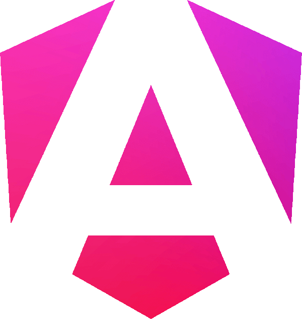

<h1 align="center">🟡 Intermediate Angular Projects</h1>

<p align="center">
  <b>Deepen your Angular skills with intermediate-level, hands-on projects.</b>
</p>

---

## 🚀 Quick Start

1. **Pick a project below.**
2. **Open a terminal in that project folder.**
3. **Install dependencies:**
   ```cmd
   npm install
   ```
4. **Run the app:**
   ```cmd
   npm start
   ```
   or
   ```cmd
   ng serve
   ```
5. **Open your browser at:** [http://localhost:4200](http://localhost:4200)

---

## 🗂️ Projects Included

-  [CMP Dashboard](./Components): Monitor servers, tickets, and traffic
- 🔃 [LifeCycle Explorer](./LifeCycle): Explore Angular component lifecycle hooks
- 🏷️ [Directives Playground](./Directives): Master custom Angular directives
-  [Forms Workshop](./Forms): Master Angular forms with interactive examples
-  [Pipes Lab](./Pipes): Transform and format data with custom pipes
- 🔗 [Services Central](./Services): Angular services, DI, and data sharing
-  [EasyTask (Routing)](<./EasyTask(Routing)>): Task manager with Angular routing
-  [EasyTask (Deployment)](./EasyTask(deployment)): Task manager with user-based routing & SSR deployment
-  [Lazy Loading & Defer Demo](./LazyLoading): Explore Angular's lazy loading and defer features

---

<p align="center">
  <b>🟡 Practice. Learn. Advance your Angular journey!</b>
</p>

[⬅️ Back to main workspace](../README.md)
