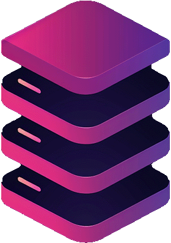

<!-- filepath: Angular\README.md -->
<h1 align="center">🌟 Angular Multi-Project Workspace 🚀</h1>

<p align="center">
  <b>The ultimate Angular playground!<br>Learn, build, and have fun with these hands-on projects.</b>
</p>

<p align="center">
  <a href="https://angular.io/" target="_blank"></a>
  <a href="other-resources/angular-course-slides.pdf"></a>
</p>

---

## 📑 Table of Contents

- [📑 Table of Contents](#-table-of-contents)
- [✨ Workspace Features](#-workspace-features)
- [🗂️ Project Directory](#️-project-directory)
  - [🟢 Beginner Projects](#-beginner-projects)
  - [🟡 Intermediate Projects](#-intermediate-projects)
  - [🔴 Advanced Projects](#-advanced-projects)
- [🚀 Getting Started](#-getting-started)
- [🎓 Featured Course \& Resources](#-featured-course--resources)
- [📚 Support \& Resources](#-support--resources)
- [📦 Projects Overview](#-projects-overview)
  - [EasyTask](#-easytask)
  - [Investment Calculator](#-investment-calculator)
  - [CMP Dashboard](#-cmp-dashboard)
  - [LifeCycle Explorer](#-lifecycle-explorer)
  - [Directives Playground](#️-directives-playground)
  - [Pipes Lab](#-pipes-lab)
  - [Services Central](#-services-central)
  - [ChangeDetection Mastery](#-changedetection-mastery)
  - [RxJS Playground](#-rxjs-playground)
  - [Place Picker](#-place-picker)
- [🤝 Contributing](#-contributing)
- [📝 License](#-license)

---

## ✨ Workspace Features

- 🧩 Multiple real-world Angular projects in one place
- 🎨 Modern, consistent UI/UX across all demos
- 📚 Ready-to-use code for learning and reference
- 🚀 Quick setup and easy navigation

---

## 🗂️ Project Directory

---

### 🟢 [Beginner Projects](./Beginner/)

| Project                                                | Description                                    |
| ------------------------------------------------------ | ---------------------------------------------- |
| [EasyTask](Beginner/EasyTask)                          | Simple, stylish task manager with user avatars |
| [Investment Calculator](Beginner/InvestmentCalculator) | Visualize your investment growth               |

---

### 🟡 [Intermediate Projects](./Intermediate/)

| Project                                          | Description                                    |
| ------------------------------------------------ | ---------------------------------------------- |
| [CMP Dashboard](Intermediate/Components)         | Monitor servers, tickets, and traffic          |
| [LifeCycle Explorer](Intermediate/LifeCycle)     | Explore Angular component lifecycle hooks      |
| [Directives Playground](Intermediate/Directives) | Master custom Angular directives               |
| [Forms Workshop](Intermediate/Forms)             | Master Angular forms with interactive examples |
| [Pipes Lab](Intermediate/Pipes)                  | Transform and format data with custom pipes    |
| [Services Central](Intermediate/Services)        | Angular services, DI, and data sharing         |

---

### 🔴 [Advanced Projects](./Advanced/)

| Project                                             | Description                               |
| --------------------------------------------------- | ----------------------------------------- |
| [ChangeDetection Mastery](Advanced/ChangeDetection) | Unlock Angular's change detection secrets |
| [RxJS Playground](Advanced/RxJs)                    | Reactive programming with RxJS            |
| [Place Picker](Advanced/PlacePicker/)               | Angular HTTP & REST API integration       |

---

## 🚀 Getting Started

1. **Pick a project from the Project Directory above.**
2. **Open a terminal in that project folder.**
3. **Install dependencies:**
   ```cmd
   npm install
   ```
4. **Run the app:**
   ```cmd
   npm start
   ```
   or
   ```cmd
   ng serve
   ```
5. **Open your browser at:** [http://localhost:4200](http://localhost:4200)

---

## 🎓 Featured Course & Resources

Take your Angular skills to the next level with this highly recommended course and its official resources:

- [Udemy: The Complete Guide to Angular (2024+)](https://www.udemy.com/course/the-complete-guide-to-angular-2/?couponCode=CP130525)  
  <sub>By Maximilian Schwarzmüller – covers everything from basics to advanced topics, with hands-on projects.</sub>
- [Official Course GitHub Repository](https://github.com/mschwarzmueller/angular-complete-guide-course-resources)

---

## 📚 Support & Resources

- 📄 [Angular Course Slides (PDF)](./other-resources/angular-course-slides.pdf)
- 📖 [Angular Official Documentation](https://angular.dev/overview)
- 💬 [Angular Community](https://angular.dev/overview#a-thriving-community)
- 📺 [YouTube Tutorials](https://www.youtube.com/@AngularUniversity)

---

## 📦 Projects Overview

### <a href="./Beginner/EasyTask/README.md"></a> <span style="color:#7C3AED"><b><a href="./Beginner/EasyTask">EasyTask</a></b></span>

> <i>A simple, stylish task manager</i>

- 📝 Create & manage tasks
- 👤 User management with avatars
- ✨ Modern UI & reusable components

---

### <a href="./Beginner/InvestmentCalculator/README.md"></a> <span style="color:#059669"><b><a href="./Beginner/InvestmentCalculator/README.md">Investment Calculator</a></b></span>

> <i>Visualize your investment growth!</i>

- 💰 Input your investment details
- ⚡ Instant calculation of returns
- 📊 Beautiful, interactive results

---

### <a href="./Intermediate/Components/README.md"></a> <span style="color:#3B82F6"><b><a href="./Intermediate/Components/README.md">CMP Dashboard</a></b></span>

> <i>Your control center for servers, tickets, and traffic</i>

- 🖥️ Server status monitoring
- 🎫 Ticket management
- 📈 Traffic analytics

---

### <a href="./Intermediate/LifeCycle/README.md">🔃</a> <span style="color:#F59E42"><b><a href="./Intermediate/LifeCycle/README.md">LifeCycle Explorer</a></b></span>

> <i>Deep dive into Angular component lifecycle hooks</i>

- 🔬 Explore Angular lifecycle hooks in action
- 🧩 Modular component structure
- 📈 Real-time updates and visual feedback

---

### <a href="./Intermediate/Directives/README.md">🏷️</a> <span style="color:#A21CAF"><b><a href="./Intermediate/Directives/README.md">Directives Playground</a></b></span>

> <i>Master custom Angular directives with hands-on demos</i>

- 🏷️ Custom attribute and structural directives
- 🔒 Safe link directive for secure navigation
- 📝 Logging directive for debugging

---

### <a href="./Intermediate/Forms/README.md"></a> <span style="color:#F43F5E"><b><a href="./Intermediate/Forms/README.md">Forms Workshop</a></b></span>

> <i>Master Angular forms with interactive examples</i>

- 📋 Reactive and template-driven forms
- 🔄 Dynamic form controls and validation
- 🎨 Custom form components and styling

---

### <a href="./Intermediate/Pipes/README.md"></a> <span style="color:#F43F5E"><b><a href="./Intermediate/Pipes/README.md">Pipes Lab</a></b></span>

> <i>Transform and format data with custom Angular pipes</i>

- 🧪 Custom and built-in pipes
- 🔤 Data formatting and transformation
- ⚡ Real-time display updates

---

### <a href="./Intermediate/Services/README.md">🔗</a> <span style="color:#0EA5E9"><b><a href="./Intermediate/Services/README.md">Services Central</a></b></span>

> <i>Master Angular services, dependency injection, and data sharing</i>

- 🔗 Reusable Angular services
- 🔄 Dependency injection best practices
- 📡 HTTP & API integration demos

---

### <a href="./Advanced/ChangeDetection/README.md">⚡</a> <span style="color:#F59E42"><b><a href="./Advanced/ChangeDetection/README.md">ChangeDetection Mastery</a></b></span>

> <i>Unlock Angular's change detection secrets!</i>

- ⚡ Explore default & OnPush strategies
- 🔍 Visualize change detection cycles
- 🚀 Performance optimization tips

---

### <a href="./Advanced/RxJs/README.md"></a> <span style="color:#0EA5E9"><b><a href="./Advanced/RxJs/README.md">RxJS Playground</a></b></span>

> <i>Reactive programming unleashed!</i>

- 🔄 Hands-on RxJS demos (observables, subjects, operators)
- ⚡ Real-time data streams and UI updates
- 🚀 Performance and best practices

---

### <a href="./Advanced/PlacePicker/README.md"></a> <span style="color:#F59E42"><b><a href="./Advanced/PlacePicker/README.md">Place Picker</a></b></span>

> <i>Angular HTTP & REST API integration</i>

- 🌐 Fetch, create, update, and delete data via HTTP
- 🛠️ Node.js/Express backend included
- ⚡ Error handling and loading states
- 📡 Real-world API demo

---

## 🤝 Contributing

Want to help? Here’s how you can contribute:

- ⭐ Star this repository to show your support.
- 🐛 [Report bugs or request features](https://github.com/Kira262/Angular/issues).
- 🔀 Fork the repo and submit a pull request.
- 📄 See [CONTRIBUTING.md](CONTRIBUTING.md) for more details.

---

## 📝 License

This workspace is for educational purposes. See individual project folders for specific licensing details if applicable.

<p align="center">
  <b>🌈 Explore. Build. Master Angular!</b>
</p>
